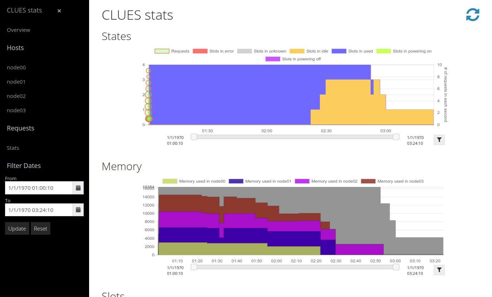
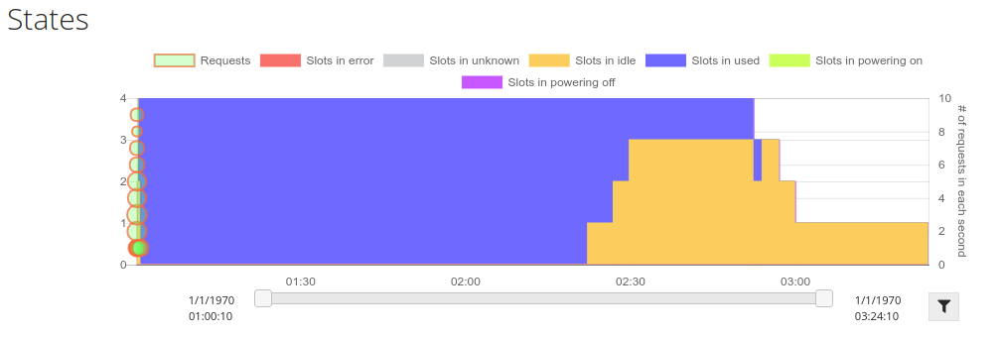
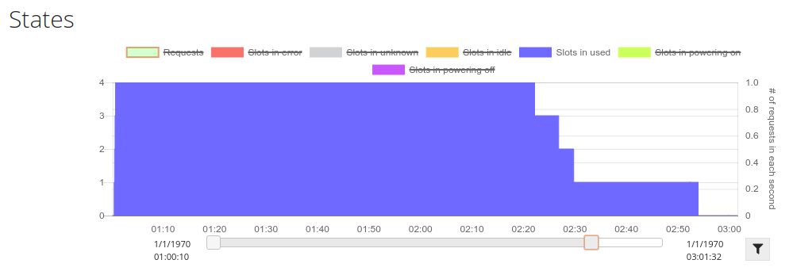
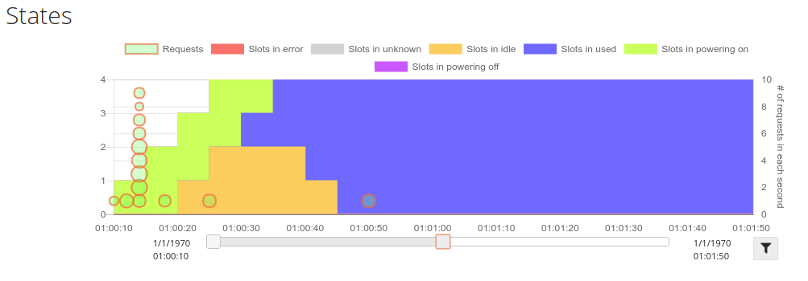
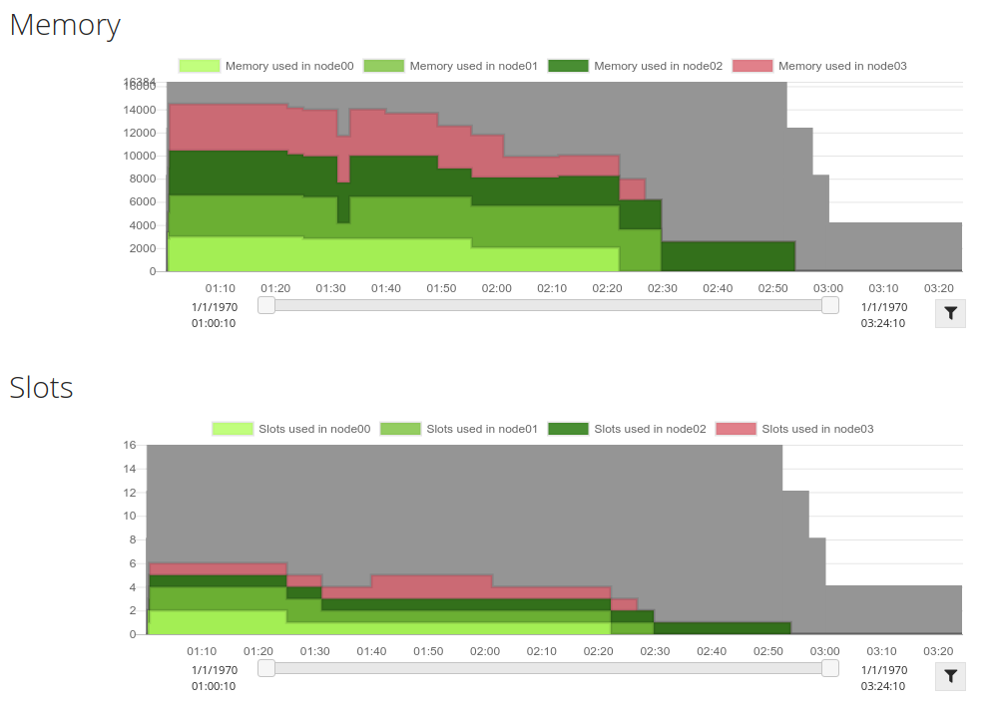
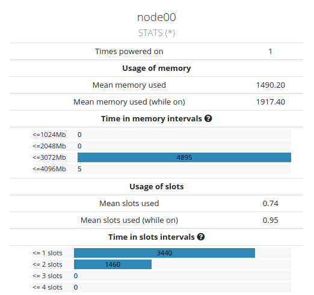
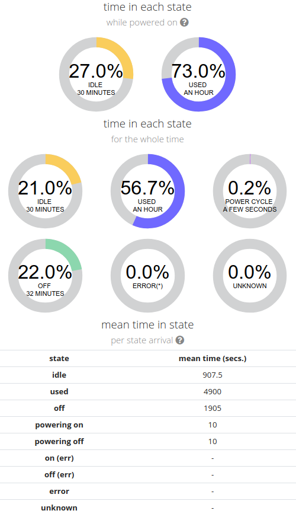
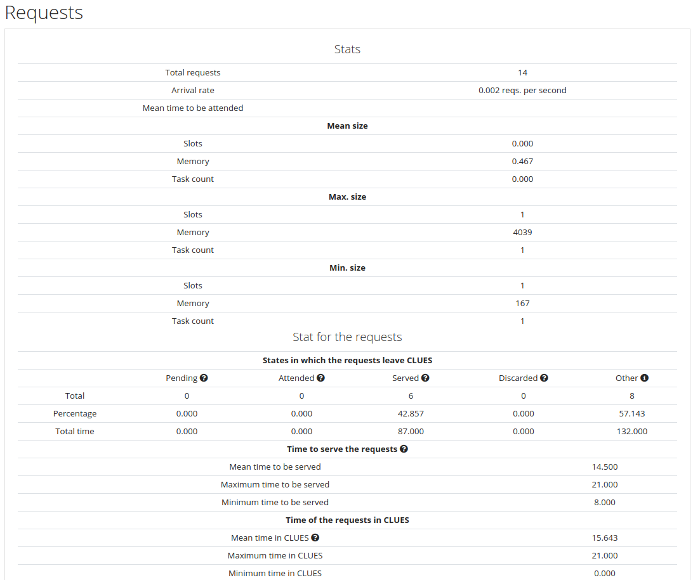
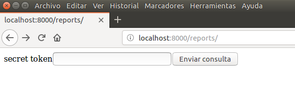
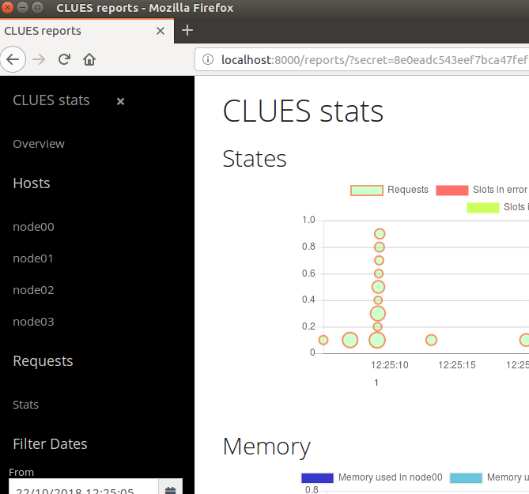

# CLUES reports
CLUES has a report generator that has been created to help to monitor your infrastructure, regarding to CLUES.

The reports that generate CLUES provide the next information:
- Graphs that show the state of the nodes during a period of time.
- Graphs of usage of slots and memory (per node, and accumulated).
- Details about the usage of each node.
- Stats about the requests that CLUES have received and attended.

## General structure

CLUES provide reports in the form of web pages. So you will need a browser to open these reports. Once opened, the reports web page will look like the next one:



In the left part, it has a basic menu that contains 
1. A link to the graphsical reports.
1. Direct links to the stats of each of the hosts in the infrastucture.
1. Direct link to the stats about the requests that CLUES has handled.
1. A time filter to delimit the time interval to which the reports are generated.

That left part can be hidden by pressing the sign 'x' and shown again using the common 3 bar mini-menu.

The right part contains all the information that has been generated as a report, in the same order that is included in the left menu.

## Information in the reports

The main section of the reports web page is the information that contains the report.

### Graphs
CLUES show two types of graphs: the evolution of the state of the nodes in the system, and the observed usage of the resources of each node.

#### States graph
The _stats graph_ is a graph that represent the number of nodes that is in a state (idle, used, off, etc.) at each timestep. It is drawn as an acummulated graph, to enable the reader to identify at a glance:
- the total amount of slots powered on in the system
- the slots that are in each state in the system



Each state is represented by an area color whose meaning is included in the legend in the top of the graph.

In the lower part of the graph, it is located a slider that can be used to delimit the zone of interest that user want to inspect. In case that the user wants to get the stats of only that delimited time interval, he can press the right button and the reports will be re-generated. 

It is also possible to hide some of the graphs by just clicking in the legend. The next figure shows some hidden graphs:



##### Requests handled by CLUES

The **requests that have been handled in CLUES** are also represented in this graph in the form of circles.

Each circle represents the arrival of a request, and their size is proportional to the size of that specific request with respect to the others.

When multiple requests arrive to CLUES in the same time slot (1 sec.) they are accummulated in vertical, to expose such event.

The next figure shows how this kind of events happen:



#### Memory and Slots graphs
The memory and slots graphs represent the amount of memory and slots used in each of each nodes, in each slot of time.

The graphs are also accummulated, to enable to identify at a glance the total amount of memory and slots used in the system, and the evolution of the usage of the resources.

The next figure shows an example of reports for memory and slots usage:



The behavior of the graphs is the same than the _states graph_. So you can use the slider in the lower part of each graph to delimit the data to show, and the button to set it as the limits for the reports.

Moreover, it is possible to show and hide series of data by clicking the legend of each graph, individually.

### Stats for each host

CLUES generates one report for each single host, containing information about the observed usage of the resources, and the states in which the host has been observed during the life of CLUES.

> The information is called "observed" because CLUES obtains it by obtaining the state of the LRMS at periodic intervals of time. So this is a representation, because CLUES cannot know what happens between observations.

#### Usage of resources

The first part of the report for each host is the usage of the resources. It is similar to the next figure:



In the report it is included the following information:
- The times that it has been powered on.
- The mean usage of the memory: the mean for the whole time, and the mean for the time while the host was on.
- The intervals of usage of the memory
  - This is a mini-report to expose the saturation of one host while it was used. The memory is divided into 4 quartiles, and the bars show the percentage of time while the host was using the amount of memory that correspond to each quartile. The value included in the bar is the total amount of seconds.
- The mean usage of the slots of the host: the mean for the whole time, and the mean for the time while the host was on.
- The intervals of usage of the slots
  - This is a mini-report to expose the saturation of one host while it was used. The number of slots is divided into 4 quartiles, and the bars show the percentage of time while the host was using the slots that correspond to each quartile. The value included in the bar is the total amount of seconds.

#### States of the host

The second part of the report correspond to the states of the host. The next figure is an example of such report:



This part has three subparts:
1. The time in each state while the host was powered on
  - Show the percentage of time that the host has passed in each of the states that imply that the host is powered on.

2. The time in each state (in general).
  - Show the percentage of time that the host has passed in each of the possible states for the host.

3. The mean time in each state per state arrival. This is the mean time that the host has passed in each state, once it has set in that state. This is very useful for (e.g.) identify the mean time to power on the node, or if the node is only powered on to have spare resources (e.g. it is only a few time used).

#### States about the requests

CLUES includes some information about the requests for resources that it has handled. The information included is similar to the one in the next figure:



It includes
- General stats: the total number of requests and the arrival rate.
- Information about the size of the requests: mean, maximum and minimum size of slots, memory and number of tasks.
- Stats about the states of the requests.

##### States of the requests
Each request in CLUES is created and then it passes through different states, while it is being attended. The states are basically
- _Pending_, in which the request is pending of being attended.
- _Attended_, when the request has been considered and its resources are being prepared.
- _Served_, when the request has resources in the system and is released to the LRMS.
- _Discarded_, when the request cannot be served due to lack of resources but it is released to the LRMS.
- _Other_ states, that include the "not served" that mean that the request has been released to the LRMS but its resources were not satisfied (e.g. the maximum time to wait for resources has been exceeded).

The report includes information about states in which the request leave CLUES: the number of requests that are found in each state, the percentage that it represents, and the total time of the requests in each state.

It is also included the mean, maximum and minimum time needed to serve the requests (that means, the time from the creation of the job until it has been released to the LRMS).

Finally it is included the mean, maximum and minimum time of the requests in CLUES (leaving CLUES in any of the possible states).

## Generating the reports

It is possible to get the reports from both an running CLUES instance, or using the `cluesreports` tool to extract the information from either a running or stopped CLUES instance. Using this tool is of special interest when you have the CLUES server stopped or you do not want to offer an external access to your CLUES server.

### Online reports tool

If you want to use the embedded report tool, you can use a web browser and access to the embedded web server at `http://localhost:8000/reports`. `localhost` should be substituted by the DNS name or the IP address of the server that runs CLUES 
> Typically you will access to your local CLUES, so it should be enough to use `localhost`.



In that page you need to provide the secret token for your CLUES installation (you should have been set it in the `clues2.cfg` file), and then you will be redirected to the main reports page.



### Offline reports tool

An alternate way to generate reports consists in using the tool `cluesreports` from the commandline.

In this case you need to have access to the CLUES database. In the case of the default installation, it is a file located in `/var/lib/clues2/clues.db`. You should check your `clues2.cfg` file to guess how to access the database.

> Using this mechanism is of special interest in the case of virtual clusters, once you have finished the interaction with them. Instead of keeping you running CLUES instance, you can stop the instance, and retrieve the data from the database for offline report generation.

To generate the report you should make a copy of the reports folder at /etc/clues2/reports for your particular usage, and then generate the `cluesdata.js` file (by using the `cluesreports` commandline util):

```console
$ cp -r /etc/clues2/reports /tmp/myreports
$ cluesreports -j /var/lib/clues2/clues2.db > /tmp/myreports/cluesdata.js
```

Once you have generated that file, you can open the file `/tmp/myreports/index.html` using a browser.

## Customizing the reports

In order to customize your reports, you can access the folder `/etc/clues2/reports` and there you will have all the files that you need to create the reports.

The basic details are:
* `index.html` is the main file, that generates all the available report information from the data obtained from CLUES (either using the `cluesreport` tool or obtained from the embedded web server).
* `cluescharts.js`, `cluesstats.js`, `minibarchart.js`, `piechart.js`, `randomColors.js` are javascript files that are used in the main report web page (`index.html`).
* `cluesdata.js` is the file that contains the data from CLUES, obtained using the `cluesreports` tool.

You are invited to modify any of the files to include your custom information (e.g. logos from your institution, additional information, etc.)

If you add more files to that folder, the embedded web server will serve them, to be included in your online reports.

## Technical details

CLUES reports has been generated using the following libraries and technologies:

- HTML, CSS, Bootstrap 4, VueJS, jQuery and Javascript.